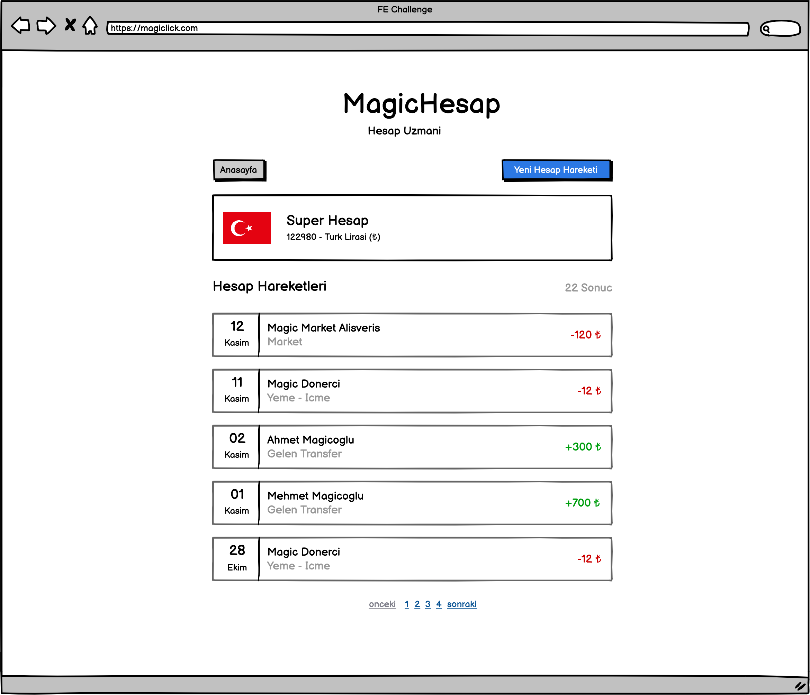

# Hesap Detay



Hesabımızın detay ekranıdır. Ekranda, dataya göre değişiklik göstermesini beklediğimiz görsellikler aşağıdaki gibidir.

- Para birimine göre değişen ülke bayrağı.
- `type` bilgisine göre değişen aktivite hareket turu.

## Servis Referansları

Hesap detayında, sadece ilgili kaydı almak adına Postman'deki `Account / Account Detail` istek örneğini kullanabilirsiniz.

```ts
type Account = {
  id: number;
  name: string;
  currency: string; // TRY, USD, GBP
  accountNumber: number;
  createdAt: Date | null;
};
```

Ayrıca, sayfanın alt kısmında hesap hareketleri bölümü mevcut. Hesap hareketlerinin tamamı, size liste içerisinde gelecek ve bu liste üzerinden önyüzde sayfalama yapılmalıdır.

Aktivite listesini almak için Postman'deki `Activity / Activity List` istek örneğini kullanabilirsiniz.

```ts
type Activity = {
  id: number;
  accountId: number;
  description: string;
  amount: number;
  type: number; // 0: Gider, 1: Gelir
  createdAt: Date;
};
```
