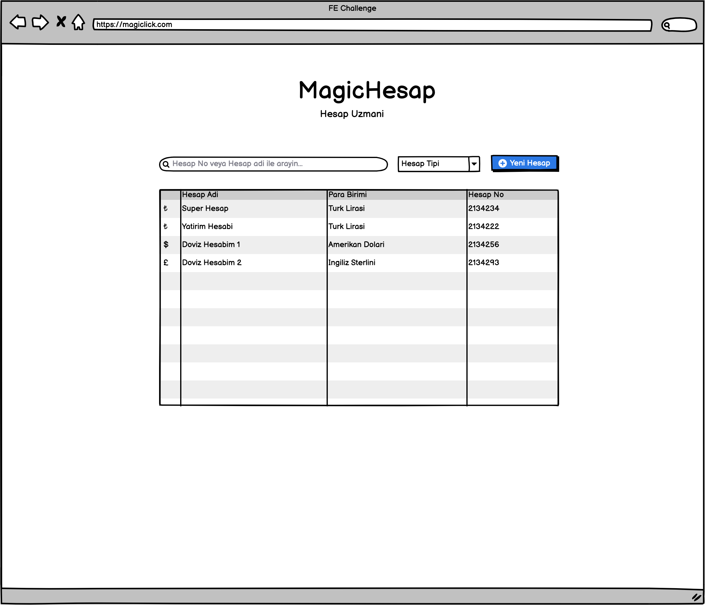

# Hesap Listesi

Hesap listesini, aynı bankanızda olduğu gibi birden fazla hesap açabileceğiniz müşteri ekranı gibi düşünebilirsiniz. Buradaki tek fark: Çok daha basit bir şekilde hesaplarınızı listeleyip yeni bir hesap ekleyebileceğiniz bir arayüz olarak düşünün.

Bu ekran için POSTMAN koleksiyonunda `Account/Account List` Endpoint'ini kullanmalısınız. Bu Endpoint, size hesap listesini ve belirtilen alanları dönecektir.

## Alan: Filtre

Bu alanda iki adet filtre bulunuyor. Bu filtreler halihazırdaki kayıtları, tarayıcıda (Client) filtreleyerek, aynı şekilde aynı alandaki listeyi de güncellemelidir. Aşağıda, hangi bileşenin hangi alan(lar)da arama yapması gerektiği belirtilmiştir.

| Filtre Adı           | İlgili Servis Referansı |
|----------------------|-------------------------|
| Arama (input)        | name, accountNumber     |
| Para Birimi (select) | currency                |

### Hesap Tipi için seçenekler

| Label            | Value |
| ---------------- | ----- |
| Türk Lirası      | TRY   |
| Amerikan Doları  | USD   |
| İngiliz Sterlini | GBP   |

## Alan: Hesap Listesi

Bu alanda, aslında hesap listesinin tamamının listelenmesi yeterli olacaktır. Para birimi simgesi, servisten gelmemekle birlikte; sizin tarafınızdan, gelen değere göre uygun bir yapıda eşleştirilmelidir.

Bunun icin `@magiclick/utils/helpers` dosyasina bakabilirsiniz.

| Alan Adı            | Servis Referansı |
|---------------------|------------------|
| Para Birimi Simgesi | -                |
| Hesap Adı           | name             |
| Para Birimi         | currency         |
| Hesap No            | accountNumber    |
