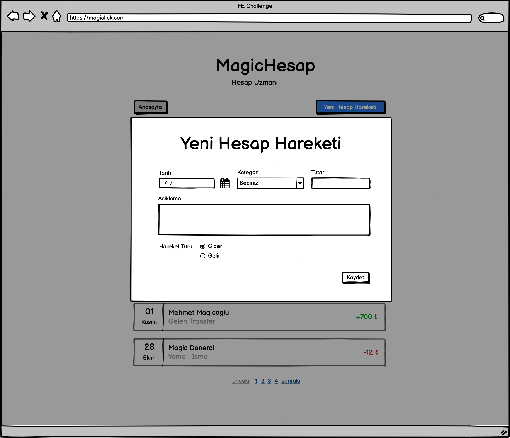

# Yeni Hesap Hareketi



Yeni Hesap Hareketi Ekleme ekranı, hesap detay ekranının üzerine bir diyalog(Modal) olarak açılacaktır. Sunucuya gönderilen istek başarılı oldugunda diyalog kapanacak, sayfadaki hesap hareketi listesi yenilenecektir. Hesap özelinde bir işlem yapıldığı için; ilgili hesabın ID'si ile işlem yapılmalı ve hesap hareketi, o hesaba eklenmelidir.

Yeni bir hesap hareketi yaratmak icin, aşağıdaki şekilde bir istek gönderilmelidir.

```ts
type ActivityCreateInput = {
  description: string;
  amount: number;
  type: number;
  createdAt: string | Date;
  accountId: number;
};
```

**Not**: _Datepicker Component'ini, direkt olarak Browser Default'u ile kullanabilir veya rahat hissettiğiniz bir NPM paketi ile site renklerine uygun olacak bir şekilde entegre edebilirsiniz._
